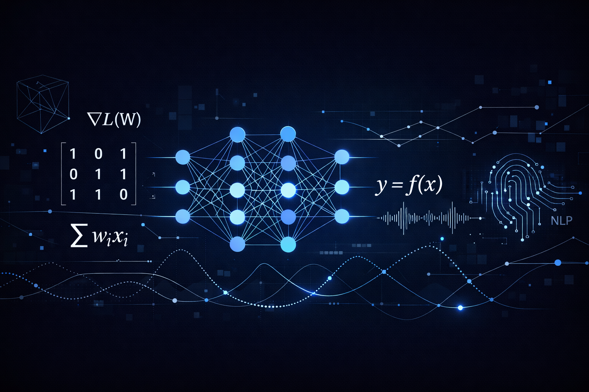

## 👋 Hi, I'm Kiana
**Data Scientist | Machine Learning & Deep Learning Engineer | Computer Vision & NLP Practitioner**  
**Applied Mathematics Background (Modeling, Optimization, Probability, Numerical Methods)**

I build intelligent systems by combining applied mathematical thinking with modern machine learning.  
My background in **Applied Mathematics** shapes the way I design models, analyze data, and build scalable ML pipelines.  
I work across **Machine Learning, Deep Learning, Computer Vision, NLP**, and **mathematical modeling**, with a focus on clean engineering and reproducible workflows.

---

## 🚀 Skills & Expertise

### 🧠 Core ML & DL
- Supervised & Unsupervised Learning  
- Deep Learning Architectures (CNNs, RNNs, Transformers)  
- Feature Engineering & Meta-Feature Design  
- Model Optimization & Evaluation  

### 👁️ Computer Vision
- Image Classification  
- Object Detection  
- Segmentation  
- Augmentation Pipelines  
- 2D & 3D images

### 🗣️ NLP
- Text Classification  
- Embeddings  
- Sequence Modeling  
- Prompt Engineering  

### 📐 Applied Mathematics (My Foundation)
- Optimization  
- Probability & Statistics  
- Linear Algebra  
- Graph Theory  
- Numerical Analysis  
- Differential Equations  
- Mathematical Modeling 

### 🛠️ Tools & Technologies
- **Python**, SQL  
- **PyTorch**, scikit-learn  
- pandas, numpy  
- Experiment Tracking & Reproducible Pipelines  

---

## 📂 Featured Projects
- **ML Feature Engineering Toolkit** — modular feature engineering utilities  
- **Neural Meta-Feature Generator** — automated meta-feature construction  
- **Vision Pipeline Template** — clean CV pipeline with reproducible structure  
- **NLP Text Modeling Suite** — embeddings + transformers + evaluation  

---

## 📈 GitHub Stats

---

## 🧩 Personal Statement
I approach machine learning through the lens of applied mathematics — clarity, structure, and precision.  
My goal is to build ML and DL systems that are **scalable, elegant, and grounded in strong mathematical reasoning**.

---

## 📫 Contact
- LinkedIn: https://www.linkedin.com/in/kiana-amini-b73564321?utm_source=share_via&utm_content=profile&utm_medium=member_android
- Email: kiana.amini99@gmail.com
